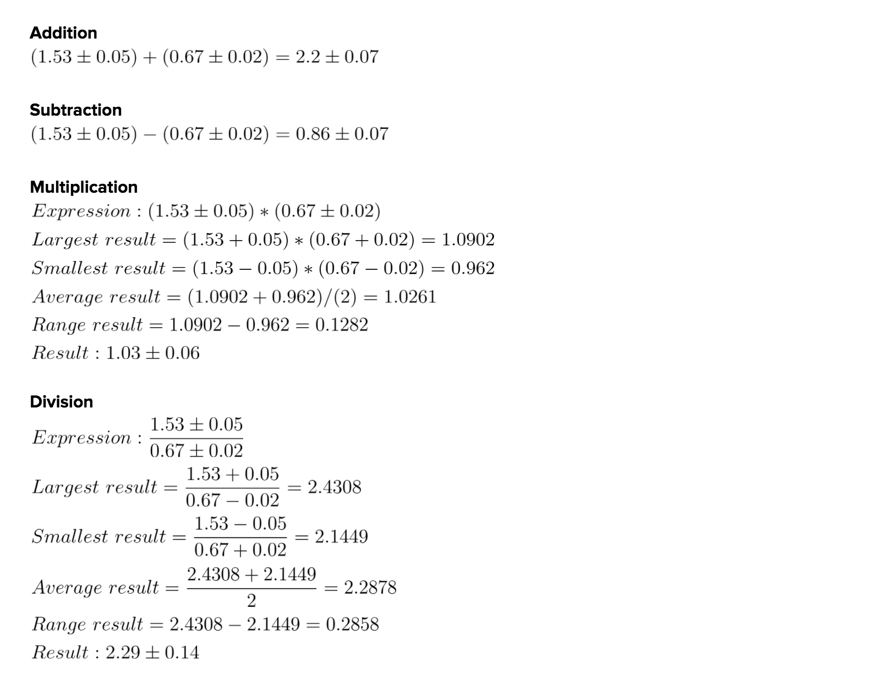

# AP Physics Tools
A collection of tools created to automate tasks for the AP Physics class (specifically at Cupertino High School).

## About

More tools will be created and added as the year goes on. All of the tools are currently written in Swift. They will probably be ported over to Java as well later on. Keep in mind that these tools are fairly simple and are meant for automating calculations and producing latex equations.

## Tools
1. Uncertainty Calculator
2. Two Point Motion Tracking for Improved Accuracy

## Documentation

### Uncertainty Calculations
This tool automatically calculates operations with uncertain numbers, and gives you the result with the new uncertainty value. Addition, subtraction, multiplication, and division are all supported.

The following is an example.

``` swift
// Create two uncertain numbers
let number1 = Uncertain(num: 1.53, uncertainty: 0.05)
let number2 = Uncertain(num: 0.67, uncertainty: 0.02)

// Operations
let resultAddition = number1 + number2
let resultSubtraction = number1 - number2
let resultMultiplication = number1 * number2
let resultDivision = number1/number2
```

With those calculations, you would get the following as output (as latex). To use this in Google Docs, get the [auto latex extension](https://chrome.google.com/webstore/detail/auto-latex-equations/iaainhiejkciadlhlodaajgbffkebdog) and you can convert the output into these beautiful equations!


### Two Point Motion Tracking for Improved Accuracy

This section does not help automate any part of a lab, but improves accuracy. Although this is not necessary on class labs because it takes longer to implement, it was an interesting topic to research. Essentially, this is a method for improving object motion tracking (video analysis) for videos taken with a free-moving camera (when the hands shake the camera). On example is when there is a ball moving along the ground, but the video is moving around slightly so it is difficult to find its velocity and acceleration (you can no longer detect relative position between each frame accurately).

When a video is shaky, it corrupts position data because the object moves with the camera in the video. To fix this, we can motion track another stationary point to use as reference, such as the corner of the grid the moving object is on. Then, by taking the difference between those 2 points, we get a new set of data points that is largely unaffected by the movement of the camera because the position is now relative to a stationary reference point, not the camera. A full section on this is in progress, but a very rough draft of this can be seen in this [Google spreadsheet](https://docs.google.com/spreadsheets/d/1x1I4tqsxokDZ__mmM2sr8pFpbypKn1SG-RLpYyncP80/edit?usp=sharing).